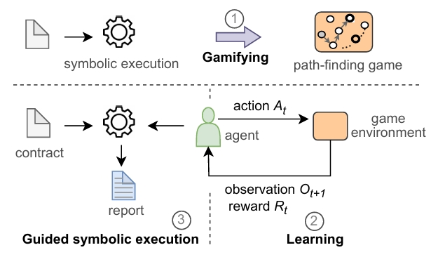

##  PolicySym 

PolicySym is a guided symbolic execution framework for security analysis on Solidity Smart Contracts. It is designed to reduce the sequence explosion by applying a learned policy to generate sequences. The policy is learned by training an agent to play a game abstracted from smart contracts using deep reinforcement learning (DRL). 





### Install solc-select and all versions of solc
```
pip install solc-select  # solc-select is a package to switch among different versions of solc (Solidity compiler)
solc-select install all  # install all possible versions of solc 
solc-select use 0.4.25   # example of using solc-select: set the version of solc to 0.4.25
```


### Run PolicySym in Pycharm IDE:

1, Create a project through Pycharm IDE by cloning https://github.com/zqp542375/drl_smartexecutor.git.

2, Create a virtual environment and install dependencies.

3, Find semyth.py in the root directory and add the parameters. Take the example of Crowdsale.sol:
```
analyze
./tests/testdata/solidity_files/Crowdsale.sol:Crowdsale
-fss rl_mlp_policy
```
4, Run semyth.py by right clicking it and select "Run semyth".


